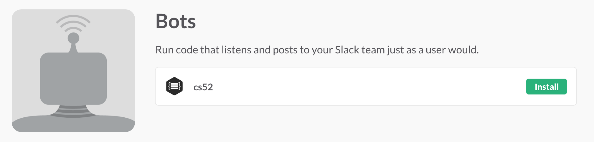

# Make a Slack Bot!


Are you ready to invent the next AI?  Any self-respecting bot needs to be able to communicate via Slack. The bot will be able to do things like respond to messages and message users as they join your Slack team. It will be a simple [Node.js](https://nodejs.org/en/) and [Express.js](http://expressjs.com/) app and run on [Heroku](https://www.heroku.com/). Don't worry if you haven't used these technologies before — all will be explained!


As a general introduction to this guide, we'll be using the command line interface (CLI) a lot. Things that require use of the CLI will be formatted as `code`. Furthermore, the bear 🐻 you see here calls attention to action items. Do these things!

## Slack Bot Basics
In Slack, bot users are similar to human users in that they have names, profile pictures, exist as part of the team, can post messages, invited to channels, and more. The main difference is that bots are controlled programmatically via an API that Slack provides. We'll be building a custom bot that listens to certain events, like a message or a new member joining your team, and responds accordingly.

## APIs

🚩Application Program Interfaces (APIs) are sets of methods and protocols by which programs talk to each other.

We'll be talking a lot more about this when we start designing our own!  But for now we'll use Slack's API to communicate with Slack's servers.

## Setup
Some of the technologies we'll be using are Slack, Github, Heroku, and Node.js. You're already familiar with Slack and Github, but Heroku and Node might be new. Node is runtime environment used for developing server-side web applications and Heroku is a [Platform-as-a-Service](https://en.wikipedia.org/wiki/Platform_as_a_service) which runs our Node application. Let's walk through these basic setup steps together.

  1. **GitHub**

    🐻Fork this repository!

  1. **Slack**

    🐻From the Slack desktop app, click on the team name in the top-left and then go to "Apps & Integrations." Search for "bot" and click the top result, "Bots." Click "Add Configuration". Choose a name for your bot and fill in the details for the bot. Take note of the API Token, we'll use it later.

    

  1. **Setup Local Environment**

    🚩Your app will need to know about the API token. This token allows you to talk to Slack's servers in an authenticated way.  API keys can be thought of as authentication for programs.

    You'll need to have the API token as a local environment variable. This way you can run and test your Node app locally and you don't have to put your secret API key into your code — which would be a security risk as then potentially it could be used by anybody if your code was public.

    You can set an environment variable with `export  <name>="XXXX"` and view it with `echo $<name>`.

    💻
    ```bash
    export SLACK_BOT_TOKEN="TOKEN_YOU_SAVED_EARLIER"
    echo $SLACK_BOT_TOKEN
    ```

    Note: on Windows try `set SLACK_BOT_TOKEN "TOKEN_YOU_SAVED_EARLIER"`.

    In our app we will be able to access this in javascript with `process.env.SLACK_BOT_TOKEN`.

    🚩 The above export only sets the variable for our currently running shell.  To save on OS X or Linux something akin to: `echo 'export SLACK_BOT_TOKEN="TOKEN_YOU_SAVED_EARLIER"' >> ~/.profile`  should do the trick, but this differs a lot by shell and operating system.

  1. **Node.js and Node Package Manager (npm)**

    🐻First, let's install [Node.js](https://nodejs.org/en/).

    macOS:
    ```bash
    brew install node
    ```

    Windows:
    download the installer from: [Node.js](https://nodejs.org/en/)

    Node's package manager, npm, is installed automatically with Node. It lets you install packages with`npm install <package> --save`

    which both installs and **saves** the package as a dependency in the `package.json file`, explained below.

    🐻Initialize your Node app:

    ```bash
    cd slackattack
    npm init
    ```

    npm will ask you bunch of questions to prepopulate your `package.json`.  This is a file that tells node things about your app.  How to start it,  what packages it depends on, who the author is etc.  

    🐻 Open your project in Atom `atom .` and massage your `package.json` file to look something like:

    ```json
    {
      "name": "jackjack",
      "version": "1.0.0",
      "description": "",
      "main": "app.js",
      "scripts": {
        "test": "echo \"Error: no test specified\" && exit 1"
      },
      "author": "Your Name",
      "license": "ISC"
    }
    ```

    Note that there are no dependencies yet. Lets add one:

    ```bash
    npm install --save express
    ```


  1. **Express**

    [Express](http://expressjs.com/) is a web framework for Node. Our main use for it is to let our Node app know which port it should listen to.

    🐻Make a new file, `app.js`, which will be the main file of our app. This could really be named anything. Later we'll look at best practices for how to structure more complicated Express.js projects.  


    At the top, include things like your packages (e.g. `var express = require('express');`). Then, add this snippet of code which will let the Node app know which port to listen to.

    ```
    var app = express();
    var port = Number(process.env.PORT || 5000);
    app.listen(port, function() {
      console.log("Listening on " + port);
    });
    ```

## Starting
The rest of this guide is more hands-off. I'll be walking you through some overarching concepts and giving pointers, but you'll be reading the Slack documentation and learning much of the Node SDK yourself.

  🐻[Real Time Messaging API](https://api.slack.com/rtm)

  🐻[Node Slack SDK](https://github.com/slackhq/node-slack-sdk)

The Node Slack SDK provides us with a convenient wrapper around Slack's API. Our bot connects to Slack's RTM API and opens a WebSocket connection with Slack. The connection is a long-lived bi-directional communication channel between your app and a server. The Node SDK README will help you get started with this connection. Go ahead and begin by doing the following:

🐻Install the SDK npm package

🐻Establish a connection with the Slack RTM client

🐻Try running your app with `node web.js`– alternatively, deploy it on Heroku!

The README will also have you listen to messages. Listening to events is incredibly important and powerful– read on for more!

## Events
The Slack server sends **events** to connected clients. These are things like [messages](https://api.slack.com/events/message) and [team join](https://api.slack.com/events/team_join) events. Events sent to your client are handled by the Node Slack package quite nicely. The following code snippet from the README listens to message events.

```
var RTM_EVENTS = require('@slack/client').RTM_EVENTS;

rtm.on(RTM_EVENTS.MESSAGE, function (message) {
  // Listens to all `message` events from the team
});
```

The format of the `message` object is defined on the Slack documentation for [message events](https://api.slack.com/events/message).

🐻As suggested by the README, try listening for the `AUTHENTICATED` event and log some data.

## Data Stores
The message event returns some important information, like the user and channel ids. What we want is to be able to turn a user id into, for example, a name or a direct message channel. The SDK Data Store will let you do this.

🐻Follow the README and set up your RTM client to also initialize a data store.

The data store is extremely powerful but lacks nicely formatted documentation. However, you can use the [source code](https://github.com/slackhq/node-slack-sdk/blob/master/lib/data-store/data-store.js) as reference material.

🐻Go ahead and set up a basic response system with your bot. When you receive a message say "hi" or give them an inspirational message– it's up to you!

At this point you have a bot which has some sort of basic response when it receives a message. However, the bot listens to messages it receives from any channel it's part of, so your response system could get annoying if the bot is part of #general.

🐻Take a look at `SlackDataStore.getChannelGroupOrDMById()` and the [objects](https://api.slack.com/types) it returns. Modify your response system to ignore messages that aren't a direct message (an "im").

## Make Your Bot Your Own
At this point you've achieved a general understanding of what goes into making a Slack bot have implemented some basic but powerful functionalities. Now, go and see what else you can do with your Slack bot. Brainstorm, read documentation, and experiment. Make your bot the best that it can be!


## Deploy On Heroku

1. 🐻Head over to [Heroku](https://www.heroku.com/) and login/sign up. Then, make a new app. In the "Deploy" tab, set the deployment method to **Github** and connect to the repo you made. Head over to "Settings" and add a Config Variable `SLACK_BOT_TOKEN` with value set to the API token of the Slack bot you made in step 1.

Heroku also requires a `Procfile` which tells Heroku what commands to run in its [dynos](https://devcenter.heroku.com/articles/dynos)

🐻Our `Procfile` is just one line, `web: node web.js`, where `web` defines the dyno type (this one receives HTTP traffic), `node` is the command and `web.js` is the name of our main Javascript file.
